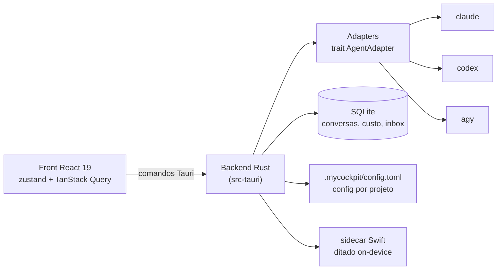

# MyCockpit

**Cockpit local-first para orquestrar as CLIs de code agents que você já tem instaladas — com custo por entrega, disputa multi-agent e pipeline spec-driven.**


<!-- Para atualizar o screenshot: rode o app (bun run tauri dev), capture a janela
     principal (⌘⇧4 + espaço no macOS) e salve como docs/screenshot.png. -->


## O que é

MyCockpit é um app desktop (Tauri 2 + React 19 + TypeScript) que vira a **única janela** para trabalhar com Claude Code, Codex e Antigravity — as CLIs que você já instalou e autenticou na sua máquina. Em vez de N abas de terminal, você abre um projeto e conversa com os agents em cartões, com diffs inline e custo visível. O diferencial: **custo por ENTREGA** (US$/feature, do PRD ao merge), **disputa multi-agent com juiz** e um **pipeline spec-driven com gates de verificação** antes do PR.

## Features

| | Feature | Descrição |
|---|---|---|
| 💬 | **Linear** | Chat com resume de sessão, fila de mensagens, diffs inline nos tools e custo por turno/sessão. |
| ⚔️ | **Fusion** | Vários agents disputam a mesma tarefa; um juiz avalia e o vencedor é promovido. |
| 📋 | **SDD** | Pipeline spec-driven: PRD → SPEC → implementação → gates de verificação → PR, com custo por entrega. |
| 🤖 | **Multi-CLI** | Claude Code, Codex e Antigravity (agy) via adapters; OpenCode em breve. |
| 🌿 | **Worktrees** | Cada conversa pode rodar num git worktree isolado, sem sujar sua árvore principal. |
| 📥 | **Inbox de decisões** | Perguntas dos agents chegam num inbox central, com notificações nativas do macOS. |
| 🎙️ | **Ditado pt-BR** | Fala → prompt 100% local (on-device), via sidecar Swift — nada sai da máquina. |
| 💡 | **Sugestões contextuais** | Um modelo helper sugere próximos passos com base no contexto da conversa. |
| ⌘K | **Command palette** | Busca full-text em conversas e ações rápidas. |
| ⚙️ | **Config persistente** | Configurações por projeto em `.mycockpit/config.toml` + backup automático do banco SQLite. |

## Começando

### Pré-requisitos

- [bun](https://bun.sh)
- Rust toolchain (`cargo`) — backend Tauri
- Xcode Command Line Tools com `swiftc` — compila o sidecar de ditado (`mycockpit-stt`)
- Pelo menos **uma CLI de agent instalada e autenticada**: `claude`, `codex` ou `agy`

O MyCockpit **não pede API key**: ele usa as CLIs (e assinaturas) que você já tem.

### Rodando

```bash
cd app
bun install
bun run tauri dev   # sobe o Vite + a janela Tauri
```

### Testes

```bash
cd app
bun run test        # vitest
```

### Build

O jeito recomendado é o canal de builds via skill do Claude Code (na raiz do repo):

```
/build            # gera um build de teste numerado em builds/test/
/build promote    # oficializa: copia pra /Applications e cria a tag oficial-N
/build list       # histórico de builds
```

Sem o skill, o build direto funciona também: `cd app && bun run tauri build`.

## Arquitetura em 60 segundos



Cada CLI é envelopada por um adapter (`app/src-tauri/src/adapters.rs`) que traduz o stream de saída para um formato único de eventos. O front nunca fala com as CLIs direto — só via comandos Tauri.

## Agents suportados

| Agent | CLI | Status |
|---|---|---|
| Claude Code | `claude` | ✅ Saída estruturada (stream-json) |
| Codex | `codex` | ✅ Saída estruturada |
| Antigravity | `agy` | ✅ Não-estruturado (texto) |
| OpenCode | `opencode` | 🔜 Planejado |

## Filosofia

- **Local-first.** Conversas, config e banco vivem na sua máquina. O ditado roda on-device.
- **BYO assinaturas.** Você usa as CLIs e planos que já paga; o app nunca vira intermediário de billing.
- **Camada fina.** O cockpit orquestra e mostra — não reinventa terminal, git ou memória de contexto.

## Roadmap

- Onboarding de primeira instalação (detecção das CLIs, setup guiado)
- Instalador DMG
- Multi-projeto em paralelo

---

Docs de arquitetura e decisões em [`docs/`](./docs/) — comece por [`docs/architecture.md`](./docs/architecture.md) e [`docs/agent-runner.md`](./docs/agent-runner.md).
