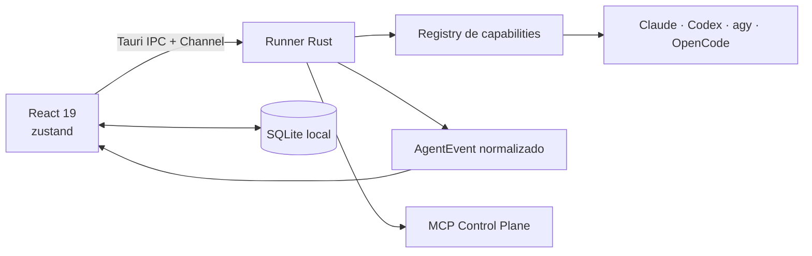

<div align="center">
  
  <h1>Frota</h1>
  <p><strong>Cockpit desktop local-first para conduzir agentes de código com o estado real do trabalho à vista.</strong></p>

  <p>
    
    
    
    
  </p>
</div>

<br />

Frota é um cockpit desktop para orquestrar agentes autônomos de desenvolvimento com transparência total: a interface reflete o estado real da frota e pede a próxima decisão humana, sem despachos ocultos, sem teatro e sem atividade inventada.

Construído com **Tauri 2 + React 19 + TypeScript + Rust**, com estado em **zustand** e persistência local em **SQLite**. O app consome as CLIs dos agentes já instaladas e autenticadas na sua máquina: credenciais, chaves e histórico permanecem 100% locais.

---

## As Três Leis da Frota

1. **Estado real, nunca teatro.** Nada de atividade inventada. "Rodando" falso é proibido; custo e estado derivam de fontes únicas. O app nunca sintetiza uma resposta que o motor não deu.
2. **A decisão é humana.** Nada de despacho automático ou delegação desgovernada. O agente pode pedir o gesto; quem confirma e autoriza é a pessoa.
3. **Agnosticismo por capacidade.** Código genérico nunca compara o nome do motor. O comportamento é derivado estritamente do registry de `Capabilities`.

---

## Superfícies Principais

| Superfície | Descrição |
|---|---|
| **Trabalho** | Conversas, diffs atômicos, planos vivos, gestão de contexto, notas e execução dos agentes em tempo real |
| **Painel** | Retrospectiva factual de custo, sessões e entregas consolidadas, sem simulação |
| **Dynamic HUD** | Instrumento de voo flutuante integrado ao notch físico e Dynamic Island no macOS, com telemetria viva e controle de parada |
| **Workspaces Globais** | Planos de voo, Agendamentos e Gestão da Frota com visões unificadas |

---

## Agentes Suportados

O registry atual oferece suporte e adapters tipados para:

- **Claude Code**
- **Codex**
- **Google Antigravity (`agy`)**
- **OpenCode**

O contrato dos adapters é declarado em Rust em [`app/src-tauri/src/adapters.rs`](app/src-tauri/src/adapters.rs) e espelhado em TypeScript em [`app/src/lib/agents.ts`](app/src/lib/agents.ts), garantido por suítes de testes de contrato.

---

## Arquitetura em um Minuto



- **Fail-open no render, fail-closed no efeito:** eventos desconhecidos preservam a estabilidade da UI como `Unknown`; efeitos sem pré-condições validadas abortam imediatamente.
- **Rascunhos desacoplados:** o transcript pertence à sessão; rascunhos não enviados residem em `useComposerDrafts` persistidos separadamente por conversa, prevenindo perda acidental de prompts.

O mapa completo de arquitetura está detalhado em [`docs/architecture.md`](./docs/architecture.md).

---

## Desenvolvimento Local

### Pré-requisitos
- [Bun](https://bun.sh)
- Toolchain [Rust](https://rustup.rs/) (cargo)
- macOS (Xcode Command Line Tools) ou Linux com dependências webkit2gtk

### Rodando em Desenvolvimento

```bash
# Entrar na pasta do frontend e instalar dependências
cd app
bun install

# Iniciar em modo desenvolvimento com Tauri
bun run tauri dev
```

### Validação e Qualidade

O repositório cobra integridade rigorosa com guardas automáticas de design, geometria e tipografia:

```bash
# Frontend: testes vitest, typecheck estrito e lints do guia de estilo
cd app
bun run test
bunx tsc -b --force
bun run check

# Backend: testes unitários e de integração Rust
cd src-tauri
cargo test
```

### Build e Empacotamento

```bash
cd app
bun run tauri build
```

---

## Documentação Canônica

Antes de contribuir ou alterar código, consulte a documentação canônica:

- [`AGENTS.md`](./AGENTS.md): fonte única das leis do repositório;
- [`docs/STYLEGUIDE.md`](./docs/STYLEGUIDE.md): guia de design, escala tipográfica e paleta;
- [`docs/decisions.md`](./docs/decisions.md): histórico de todas as ADRs de arquitetura;
- [`docs/architecture.md`](./docs/architecture.md): mapa vivo de donos de estado e contratos.
