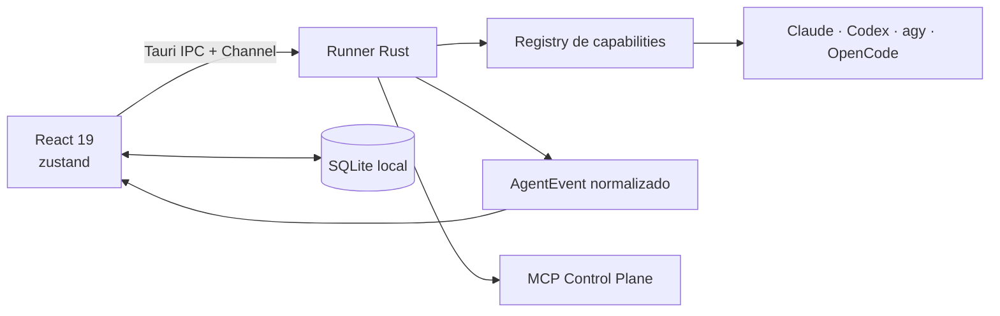

# Frota

Frota é um cockpit desktop, local-first, para conduzir agentes de código com o
estado real do trabalho à vista. O app organiza conversas, decisões pendentes,
alterações, custo, missões e evidências sem esconder o gesto humano que inicia
ou aprova uma ação.

O produto é Tauri 2 + React 19 + TypeScript, com backend Rust, estado de UI em
zustand e persistência SQLite via `@tauri-apps/plugin-sql`. Ele usa as CLIs já
instaladas e autenticadas na máquina; credenciais e histórico permanecem
locais.

## Superfícies atuais

| Superfície | Papel |
|---|---|
| **Painel** | retrospectiva de custo e entregas, sem fingir atividade |
| **Trabalho** | conversas, diffs, planos vivos, decisões, notas e execução dos agentes |

Planos de voo, Agendamentos e Frota são workspaces globais abertos sobre essas
superfícies. Especialistas aconselham ou pilotam dentro do mesmo conceito de
agente; a decisão final continua sendo humana.

## Agentes

O registry atual oferece adapters para:

- Claude Code
- Codex
- Antigravity (`agy`)
- OpenCode

Capacidade nunca é inferida pelo nome do fornecedor. O backend declara o
contrato em `app/src-tauri/src/adapters.rs`, a UI mantém o espelho em
`app/src/lib/agents.ts`, e testes de contrato impedem divergência silenciosa.

## Arquitetura em um minuto



A UI renderiza eventos normalizados e degrada de forma honesta quando um
adapter não oferece determinada capacidade. Conversas persistem o transcript;
rascunhos não enviados são uma entidade separada, por conversa, e nunca entram
no prompt antes do envio.

O mapa detalhado e os donos de estado estão em
[`docs/architecture.md`](./docs/architecture.md). O contrato dos adapters está
em [`docs/agent-runner.md`](./docs/agent-runner.md).

## Desenvolvimento

Pré-requisitos: Bun, toolchain Rust e Xcode Command Line Tools no macOS. Para
usar um agente, a CLI correspondente precisa estar instalada e autenticada.

```bash
cd app
bun install
bun run tauri dev
```

Validação completa exigida pelo repositório:

```bash
cd app
bun run test
bunx tsc -b --force
bun run check

cd src-tauri
cargo test
```

O build de pacote pode ser feito com `cd app && bun run tauri build`. O canal
numerado e a promoção para `/Applications/Frota.app` vivem em
`scripts/build.sh` e na skill `/build`.

## Para agentes e contribuidores

Leia [`AGENTS.md`](./AGENTS.md) inteiro antes de editar. Ele é a fonte única das
leis do repositório e aponta os documentos canônicos por assunto:

- [`docs/STYLEGUIDE.md`](./docs/STYLEGUIDE.md), linguagem visual;
- [`docs/decisions.md`](./docs/decisions.md), decisões estruturais;
- [`docs/architecture.md`](./docs/architecture.md), arquitetura atual;
- `docs/*-plan.md`, histórico e plano de cada frente, sempre respeitando os
  blocos de correção/status no topo.

O nome público é Frota. Identificadores persistidos como `mycockpit.db`,
`.mycockpit/`, `mc.app` e `dev.vinicius.mycockpit` são contratos legados
intencionais e não devem ser renomeados sem uma migração de compatibilidade.
