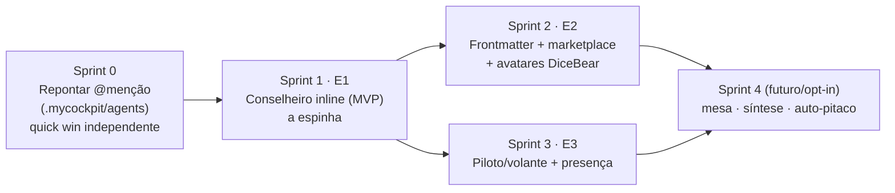

# Plano de ação — Especialistas

> **✅ ENTREGUE (2026-07-29) — E1·E2·E3 na `main`.** Conselheiro read-only (`fusion-ro`),
> marketplace + avatares DiceBear, piloto/volante + barra de presença, chat estilo Slack e
> composer Lexical (menção atômica, único composer). Decisões congeladas em
> **ADR-026** (Especialista: papel, não modo) e **ADR-027** (cutover do composer).
> **E4** (mesa/síntese/auto-pitaco) segue **deliberadamente adiado** — aditivo, jamais modo.
> Este arquivo fica como o registro do *intento*; a verdade do que existe está no código + ADRs.
>
> Backlog scrum da evolução "Especialistas" na Frota. Data: 2026-07-28.
> Inspiração de discovery: gallery "Personas by Garry Tan" + estudo do `block/buzz`
> (Slack onde agentes são membros). Mocks: `docs/mocks/marketplace.html`.
>
> **Premissa que guia tudo (poda já feita):** Especialista **NÃO é um modo** ao lado
> de Mission (pipeline autônomo) e Disputa/Fusion (competição+juiz). É uma **camada
> fluida DENTRO da conversa normal** — você vai `@mencionando` no meio do trabalho, o
> especialista lê o contexto/diff e **opina inline**, você age. Não existe "Motor
> Frota", toggle de modo, nem orquestrador com marca. A orquestração que sobra (quem
> fala quando) é encanamento invisível. Extras (mesa/síntese/auto-pitaco) são
> **aditivos opt-in pós-MVP**, nunca modo. Respeitar `autonomy.md`: campo reservado
> vale mais que mecanismo especulativo.
>
> **1 conceito só:** `Especialista` = a persona que o dev já materializou em
> `.mycockpit/agents/*.md` (ADR-025). O "executor" é apenas **o especialista que está
> com o volante**. Não há entidade nova, nem tabela nova.

## Contexto: onde já estamos (ADR-025 do dev — não reconstruir)

O dev migrou personas de SQLite → **arquivos `.mycockpit/agents/<slug>.md`** (escopo
projeto + global `~/.mycockpit/agents/`, projeto vence). Isso **é** o domínio agnóstico
e file-based que a gente queria; o registro dos Especialistas já existe.

| Peça | Já temos (dev/ADR-025) | Gap real |
|---|---|---|
| Registro de persona | `.mycockpit/agents/*.md` + `lib/agentDefs.ts` (frontmatter `name/backend/model/effort/skills/policy/version` + corpo=`personalityMd`), CRUD Rust `read/write/delete_agent_def`, `store/presets.ts`, migração SQLite→arquivo | falta **`categoria`, `rubrica`, `avatar`** no frontmatter |
| Injeção agnóstica | cascata **persona→doutrina→lições→pedido** (ADR-025); `resolveFirstTurnPersona` injeta a persona no **turno-1 como executor** | falta **invocar como conselheiro no MEIO da conversa** (contexto atual, não turno-1) |
| Menção `@` | `useAtMentions.ts` já tem popover de `@` (agents+arquivos) | **lê o lugar VELHO** (`readProjectSources().personas` = `.claude/agents`), não `.mycockpit/agents` — inconsistência a corrigir |
| Versionamento/drift | `presetDigest` recomputa do conteúdo → editar `.md` à mão dispara drift nas conversas carimbadas | reusar; carimbar também o parecer (persona@version) |
| Supervisão humana | aprovação/cancelar/fail-closed (ADR-013/021/024) | reusar — **nenhuma trava nova** |
| CRUD/Settings | `PresetSettings.tsx` lê/edita as personas em arquivo | falta o **marketplace em dialog** (cards + criar + avatar) |

Fonte de verdade = **o arquivo** (padrão da casa, igual `config.toml`/`instructions.md`).
Identidade da persona = campo `id` (migrados) ou `scope:slug`.

## Épicos

- **E1 · Especialista conselheiro (MVP)** — `@menção` na fonte certa + invocar a persona
  como conselheiro contra o contexto atual → parecer inline. É a espinha, 0% motor.
- **E2 · Identidade & marketplace** — frontmatter `categoria/rubrica/avatar` (DiceBear) +
  Dialog shadcn (grid de cards + detalhe + criar) sobre a conversa.
- **E3 · Piloto/volante & presença** — estado de conversa: quem pilota, convidados,
  "passar o volante", barra de presença estilo Slack.
- **E4 · (futuro/opt-in)** — grupo salvo (mesa), especialista-de-síntese, auto-pitaco.
  Aditivos, **jamais modo**.

## Sequência (dependência + valor)

Racional: **S0 primeiro** — barato, independente, corrige a inconsistência do `@` e
destrava o resto. **S1 é a espinha** (entrega ~80% do valor sozinho: mencionar 1
especialista). **S2 e S3 paralelizáveis** depois. **S4** é aditivo, só quando o núcleo
provar uso.

---

## Sprint 0 · Repontar `@menção` pro `.mycockpit/agents` (quick win)

**Objetivo:** o `@` do composer e o seletor de preset lerem a **mesma** fonte real
(`.mycockpit/agents`), não o `.claude/agents` legado. Corrige a única peça solta.

**Stories**
- **S0.1** — `useAtMentions.ts`: trocar `readProjectSources().personas` (`sources.ts`,
  lê `.claude/agents`) por `listAgentDefs(projectPath)` (`lib/agentDefs.ts`). O popover
  passa a listar as personas do app (projeto vence global). Arquivos seguem via
  `listProjectFiles`.
- **S0.2** — `AtItem` carrega identidade resolvível: hoje é `{kind:"agent", value:name}`;
  passar a levar `id` (`scope:slug`) além do nome, pra o Sprint 1 saber QUAL persona
  invocar sem ambiguidade de nome.
- **S0.3** — nota de agnosticismo: o painel (`ContextPanel`/`DoctrineSection`) segue
  mostrando `.claude/agents`/`AGENTS.md` como **contexto externo lido por code agents** —
  não confundir com as personas do app. Só um comentário/rótulo, sem código novo.

**Critério de aceite:** `@` lista as personas de `.mycockpit/agents` (idênticas ao
seletor de preset), projeto sombreia global no mesmo slug, arquivos continuam
mencionáveis; teste vitest (PT) de que o item de menção resolve pro `id` certo.

**Guardas:** nenhuma regressão no seletor de preset (mesma fonte); sem tocar no painel de
inventário além do rótulo.

---

## Sprint 1 · E1 — Especialista conselheiro inline (MVP, 0% motor)

**Objetivo:** `@aline revisa isso` → Aline lê o diff/contexto **atual** → **parecer
inline** marcado como dela → você decide o que fazer. Nada tocado no disco.

> Diferença-chave do que existe: `resolveFirstTurnPersona` (`lib/presets.ts`) injeta a
> persona **no turno-1 como o executor**. Aqui é o oposto — invocar uma persona **no meio**
> da conversa, contra o estado atual, **sem** ela virar o executor.

**Stories**
- **S1.1 — invocação de conselheiro** (`lib/advisor.ts`, novo): monta o prompt =
  `AgentDef.personalityMd` (+ `rubrica` quando existir, S2) + **contexto serializado** da
  conversa/diff (reusa `serializeContext`/`exportConvContext` de `lib/transcript`) + a
  pergunta do usuário. Dispara pelo `runAgent` (`lib/agent.ts`) no backend da persona.
  **Read-only por padrão** (não escreve working tree).
- **S1.2 — parecer inline** (`MessageList`/`ChatPanel`): item novo no fio, marcado
  "parecer de <persona>" com identidade própria (avatar S2), **distinto** de uma ação do
  executor. Carimba `persona@version` + digest (auditoria/drift, reusa `presetDigest`).
- **S1.3 — ações do parecer:** "Trazer pro Executor" (injeta o parecer no próximo turno do
  piloto — reusa a montagem de bloco de `personaHandoffBlock`) e "Dispensar". Volante fica
  pro Sprint 3.
- **S1.4 — supervisão reusada:** se um conselheiro for configurado pra agir (fora do MVP),
  entra pela MESMA fila de aprovação/cancelar (ADR-013/024). No MVP ele só opina.

**Critério de aceite:** mencionar 1 especialista lê o diff atual e responde inline; o
parecer não altera nada em disco; "Trazer pro Executor" injeta no próximo turno; conversa
carimbada mostra qual persona@version opinou; teste vitest (PT) do prompt montado
(persona+contexto+pergunta) e do read-only.

**Guardas:** conselheiro nunca escreve sem aprovação humana; sem orquestrador; um `@` =
uma consulta; fail-closed se a persona não resolver (mensagem clara "não existe" vs "não
consegui ler", como `getAgentDef` já distingue).

---

## Sprint 2 · E2 — Identidade & marketplace

**Objetivo:** dar cara aos especialistas (avatar/categoria/rubrica) e o marketplace em
**dialog shadcn** sobre a conversa (padrão blocks.so Member-List → grid de cards).

**Stories**
- **S2.1 — frontmatter novo** (`lib/agentDefs.ts`): adicionar `category`, `rubric` (lista,
  reusa `parseSkillsList`), `avatar` (`style` + `seed` DiceBear) em `serializeAgentDef` +
  `defFieldsFrom` + `AgentPresetInput`/`AgentDef`. **Retrocompat:** ausência = defaults
  (`avatar.seed=slug`, `style=glass`; `category="Geral"`; `rubric=[]`). Não quebra persona
  existente nem a migração.
- **S2.2 — DiceBear offline** (`@dicebear/core` + `@dicebear/collection`): componente
  `<AgentAvatar def size>` que gera SVG do `style`+`seed` (determinístico, sem rede).
  Substitui a inicial/emoji onde a persona aparece (composer, presença, parecer, cards).
- **S2.3 — Dialog "Especialistas"** (shadcn, sobre a conversa): grid de **cards** de
  `listAgentDefs`, busca + categoria; clicar → **detalhe no mesmo dialog** (briefing +
  rubrica + config + como invocar); **Criar** = form + **preview ao vivo** (seletor de
  estilo DiceBear + "variar"). Reusa o CRUD existente (`store/presets` create/update/remove
  → `saveAgentDef`). Amplia/substitui `PresetSettings.tsx`. Referência de layout:
  `docs/mocks/marketplace.html`.
- **S2.4 — escopo no criar:** projeto vs global (já suportado no `store/presets` +
  `slugLivre`); default projeto.

**Critério de aceite:** criar um especialista grava `.mycockpit/agents/<slug>.md` com
`category/rubric/avatar`; avatar DiceBear determinístico e offline; editar o `.md` à mão
reflete na UI e dispara drift; dialog abre sobre a conversa sem trocar de tela; personas
antigas (sem os campos novos) aparecem com defaults; testes vitest (PT) de
serialize/parse dos campos novos + retrocompat.

**Guardas:** arquivo continua fonte de verdade; frontmatter legível à mão (só cita quando
precisa, `citar`); sem dependência de rede pro avatar; sem tabela nova.

---

## Sprint 3 · E3 — Piloto/volante & presença

**Objetivo:** materializar "um pilota por vez, os outros opinam", estilo Slack.

**Stories**
- **S3.1 — estado de conversa:** `pilotId` = a persona que age nos turnos (é o preset já
  carimbado na conversa no 1º run — reusar, não inventar) + `guests[]` = personas
  mencionadas presentes (efêmero, em memória por conversa).
- **S3.2 — "passar o volante":** troca o executor dos próximos turnos pra outra persona,
  transplantando a doutrina via `personaHandoffBlock` (já existe em `presets.ts` — "a
  doutrina viaja no transplant"). Recarimba a conversa com a nova persona@version.
- **S3.3 — barra de presença** no topo da conversa: avatares dos participantes + quem
  pilota + a linha "X entrou na conversa" quando um especialista é chamado (mock já
  desenhado).

**Critério de aceite:** passar o volante troca a persona dos próximos turnos com handoff de
doutrina e novo carimbo; presença reflete participantes + piloto; supervisão intacta;
teste vitest (PT) do handoff (doutrina viaja) e do recarimbo.

**Guardas:** só **um** piloto por vez (autoria limpa); troca de volante é gesto humano
explícito; convidado não vira piloto sem você mandar.

---

## Sprint 4 · (futuro / opt-in) — aditivos, NÃO modo

Só quando o núcleo (S0–S3) provar uso diário. Cada um se justifica separado; **nenhum
vira modo**.

- **Grupo salvo ("mesa"):** `@time-review` = um alias que convoca N especialistas de uma
  vez. É um arquivo de grupo em `.mycockpit/`, não um motor.
- **Especialista-de-síntese:** uma persona cujo trabalho é **ler os pareceres dos outros**
  e consolidar (dedup + N ações). É um especialista, não um engine — some como conceito
  separado.
- **Auto-pitaco (opt-in):** um especialista pode **entrar sozinho e comentar** sem ser
  chamado (ex.: Segurança revisa todo diff antes de aplicar). **Ligável**, jamais
  obrigatório, sempre sob a supervisão que já existe. Vira selo ("Segurança: sem risco
  novo") conectado ao gate de aprovação.

---

## Definition of Done (todas as sprints)

- **Sem tabela nova.** Fonte de verdade = `.mycockpit/agents/*.md`. Nada volta pro SQLite.
- **Agnóstico a code agent.** A definição é do mycockpit; backend (opus/codex/agy) só
  *move* o especialista. Nada acoplado a `.claude/`.
- **`@menção` e seletor de preset leem a MESMA fonte.** Uma inconsistência aqui reabre o
  Sprint 0.
- **Conselheiro read-only por padrão;** ação só pela supervisão humana existente
  (aprovar/cancelar/fail-closed). Nenhuma trava/permissão nova.
- **Sem "modo Frota"/motor/toggle.** Camada fluida na conversa.
- **Drift por digest preservado** (editar `.md` à mão avisa a conversa carimbada).
- **Testes vitest em PT-BR**, cobrindo o critério de aceite (não só o caminho feliz);
  fail-closed testado; retrocompat das personas sem os campos novos.
- **Escopo projeto + global** funciona em tudo (projeto vence global no mesmo slug).

## E5 — Radar da "troca genuína" (03/08/2026, pós-clone do block/buzz)

> Registro de intento, sem compromisso de entrega. Fontes: uso hardcore do
> Warp multi-janela (a dor que criou a Frota), `~/projetos/mypeople`
> (absorver: roles+digest, ping, watchdog; NÃO absorver: despacho por LLM) e
> `~/projetos/buzz` (clonado 03/08 — Slack self-hosted onde agentes são
> membros; tudo é evento assinado num log único; buzz-agent: sessões baratas,
> "quando não pode prosseguir, para").

**Tese central: troca genuína = assimetria, não adjetivo.** Duas personas do
mesmo modelo com o mesmo contexto e system prompts diferentes = teatro caro.
A conversa só é genuína quando cada especialista (1) SABE coisas diferentes e
(2) OLHOU para coisas diferentes. As camadas, em ordem de construção:

1. **Inteligência alimentada por persona** (a base, sem RAG novo): as lições
   ("Transformar em aprendizado") ganham DONO — cada especialista acumula as
   suas, e o recall na injeção filtra pelo dono. O FTS que o ⌘K já usa cobre o
   começo; embeddings só quando o corpus estourar o FTS (não antes — campo
   reservado > mecanismo especulativo). Corpus opcional por persona:
   `.mycockpit/agents/<slug>/knowledge/*.md`.
2. **Quem fala quando = assinatura determinística + peek barato** (lição do
   mypeople: jamais orquestrador-LLM com marca): a persona declara interesses
   (globs de arquivo no diff, eventos: turno falhou, workflow concluiu, custo
   estourou o teto, disputa aberta). Evento casa → o modelo HELPER (o mesmo
   das sugestões) faz um peek no digest e decide se acorda a persona cara.
   Interjeição tem orçamento por conversa + cooldown + custo visível.
3. **Threads de verdade** (o que faz "sentir Slack"): o pitaco entra como
   thread lateral ancorada na mensagem que o disparou, colapsada no fio
   principal, com contexto ESCOPADO à thread (custo contido). Discussão entre
   especialistas acontece NA thread; o fio principal segue do piloto.
4. **Dedupe de vozes**: antes de acordar a persona B, o peek vê o que A já
   disse na thread; instrução fixa "só entre se tiver algo NOVO" + teto duro
   de N interjeições. Três personas dizendo o mesmo é o anti-padrão nº 1.
5. **Do buzz, absorver**: presença de agente como membro (a barra E2 já
   aponta pra isso), "tudo é evento num log só" (mycockpit já caminha:
   work://, update://; a thread de especialistas seria mais um evento), e a
   honestidade do buzz-agent (interjeição que não agrega, silencia — parar é
   primeira classe).

**Invariantes que NÃO mudam (ADR-026):** um pilota por vez; especialista
opina, humano age; auto-pitaco é opt-in por persona×projeto, jamais modo;
read-only fail-closed.

## Os Especialistas DESTE projeto (15/09/2026)

A equipe inicial (`lib/marketplace.STARTER_TEAM`) é global e genérica. A Frota
passa a ter também os seus, versionados em `.mycockpit/agents/`, que viajam no
clone e são revisáveis em PR:

| Persona | Domínio | O que ela cobra |
|---|---|---|
| Régua | Design | as escalas fechadas, a primitiva única e a copy do STYLEGUIDE |
| Fronteira | Engenharia | capability nos dois lados, nada de nome de motor em código genérico |
| Cronômetro | Ops | custo proporcional ao gesto, nunca ao histórico |
| Prova | Qualidade | fixture real, teste que morde, suítes rodadas de verdade |

Cada uma tem `policy` de só apontar: a mão no código continua sendo de quem
entrega. A rubrica do frontmatter é o que aparece no parecer, então ela é curta
e verificável, não um manifesto.

Guarda: `lib/agentDefs.projeto.test.ts` lê os arquivos REAIS pelo mesmo parser
da UI. Frontmatter torto não quebra a tela em silêncio (a persona chegaria sem
voz, sem rubrica e com a cor de "Geral"); quebra o teste.
