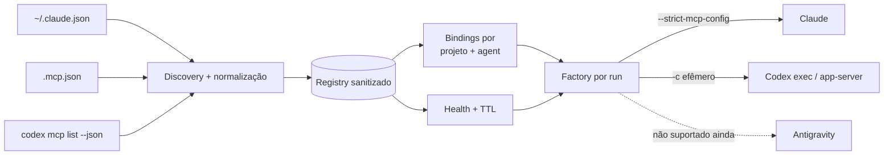

# MCP Control Plane

## Objetivo

O MyCockpit trata MCP como uma capability do projeto, e não como uma
configuração acidental do CLI que estiver aberto. O control plane descobre
servidores existentes, normaliza os formatos, testa disponibilidade, guarda a
política por projeto e monta uma configuração efêmera para cada run.

Isso resolve o caso em que o Claude conhece `Hostinger`, mas o Codex aberto no
mesmo projeto não: depois de criar um binding portável para o Codex, o próximo
run recebe o mesmo servidor sem copiar segredo para o banco ou alterar
`~/.codex/config.toml`.



## Descoberta e modelo canônico

As fontes atuais são:

- MCPs `user` do Claude em `~/.claude.json`;
- MCPs `local` do Claude dentro do registro daquele projeto;
- `.mcp.json` compartilhado na raiz do projeto;
- saída estruturada de `codex mcp list --json`;
- MCPs internos `mc-context` e `mc-approval`, apenas para visibilidade.

Cada entrada é convertida em `McpLaunchConfig`, com transporte `stdio` ou
`http`, command/URL, argumentos e **nomes** das referências de ambiente. O ID
inclui origem, escopo, nome e um digest curto para evitar colisões. O nome de
runtime também inclui esses ponteiros, então duas integrações homônimas de
escopos diferentes não se sobrescrevem.

O registry SQLite (`mcp_servers`) não guarda valor de token ou header. Userinfo,
query string e fragment são removidos do URL exibido/persistido. Valores
literais de `env` ou `headers` tornam a entrada não portável; referências como
`${MCP_TOKEN}` são traduzidas entre os formatos de Claude e Codex sem resolver
o segredo.

## Bindings e roteamento

`mcp_bindings` relaciona:

```text
project_id + server_id + agent
```

com quatro decisões independentes:

- `enabled`: disponibilizar a capability naquele agent;
- `browser`: entregar o navegador possuído pela Frota, sem torná-lo obrigatório;
- `required`: impedir o envio se a capability não puder ser materializada;
- `fallback`: `ask`, `deny` ou `allow-readonly`.

Sem nenhum binding explícito para o agent, a Frota preserva o comportamento
nativo do CLI. A partir do primeiro binding, o run entra em modo gerenciado:

- Claude recebe `--strict-mcp-config` e um JSON efêmero com apenas os MCPs
  selecionados, mais os MCPs internos aplicáveis;
- Codex recebe overrides `-c` antes de `exec` ou `app-server`; os MCPs globais
  descobertos são desativados somente naquele processo e os selecionados são
  injetados com nomes de runtime;
- nenhuma configuração global do usuário é reescrita.

Ao desativar um MCP global no Codex, o factory materializa primeiro seu
transporte público completo (`url` ou `command`/`args`/`cwd` e nomes de env) e
só então aplica `enabled=false`. Isso atende à validação do `config.toml` do
Codex sem copiar credenciais e evita o falso erro `invalid transport` visto
quando apenas o nome e o flag eram enviados.

O control plane não autoaprova tools externas. Estar habilitado significa
“disponível ao agent”, não “autorizado a produzir efeito externo”.

### Política quando o MCP falha

`fallback` só produz efeito quando `required = true`. Binding opcional
indisponível é omitido do plano, qualquer que seja o valor salvo:

| Binding exigido | Comportamento |
|---|---|
| `ask` | Gate antes do turno; a pessoa pode corrigir ou omitir somente neste envio. |
| `deny` | Gate antes do turno, sem bypass. Só corrigir a configuração libera. |
| `allow-readonly` | Gate antes do turno; a pessoa pode autorizar um caminho alternativo somente leitura neste envio. |

O override leva fingerprint, fonte e recovery tipada. O Rust revalida os três
contra a policy atual e nunca altera o binding persistido.

## Health e preflight

`mcp_health` guarda status por projeto, servidor e agent, com TTL de cinco
minutos:

- `stdio`: inicia o processo, executa o handshake MCP `initialize`, envia
  `notifications/initialized` e chama `tools/list`;
- `http`: envia um `initialize` por HTTP para validar endpoint/protocolo;
- `auth-required`: o endpoint respondeu, mas falta autenticação;
- `auth-delegated`: o endpoint respondeu 401/403, porém a configuração possui
  referência de ambiente disponível; a credencial continua delegada ao
  processo do agent e não é lida/persistida pelo registry;
- `healthy`: handshake/listagem (stdio) ou endpoint MCP HTTP alcançável.

Uma mudança no fingerprint do command/endpoint invalida imediatamente o health
cache anterior. Antes de um run gerenciado, um resultado ausente ou vencido é
testado novamente. Um binding opcional indisponível aparece como omissão no
manifesto efetivo. Um binding obrigatório gera `preflight_blocked` antes do
manifesto, do processo e da chamada paga.

## Uso na interface

Em **Configurações → Integrações MCP**:

1. escolha o escopo no seletor **Bindings do projeto** no cabeçalho. O default
   é o projeto ativo da sidebar; cada item mostra a contagem de bindings
   daquele projeto (ex.: "viniciusmachado · 2"), então "cadê meus toggles?" se
   responde olhando o dropdown. Trocar o projeto aqui muda só o escopo do
   painel, nunca o projeto ativo do app;
2. use **Redescobrir**;
3. localize o servidor e confira origem, escopo e transporte;
4. habilite o binding no Claude ou Codex;
5. marque **exigir** quando a tarefa não puder prosseguir sem essa capability;
6. escolha a política de fallback;
7. use o botão de teste para validar a conexão.

O toggle é otimista com verdade no fim: marca na hora, validado contra o
registry persistido (sem re-descoberta ao vivo a cada clique); se o backend
recusar, o toggle reverte com o motivo. No primeiro enable, o health check roda
em segundo plano e a linha mostra "verificando…" até o resultado real chegar.
Configurações com segredo literal ficam visíveis, mas desabilitadas para
roteamento até migrarem para wrapper/Keychain ou referência de ambiente.

### Os dois motivos de não ser roteável

Um servidor sai do roteamento por duas causas independentes, e a UI diz qual é
(elas podem aparecer juntas):

| Causa | O que a tela diz | Saída |
|---|---|---|
| `nativeReason` (`oauth`, `stream`, `headers-helper`) | Dependência do CLI de origem: o token do OAuth vive no keychain de quem autenticou, a sessão SSE/WS é mantida pelo CLI, o helper de header roda dentro dele. Cita onde já funciona nativo. | Autenticar no outro CLI, trocar por endpoint HTTP MCP ou por env ref. Nada a migrar no arquivo. |
| `literalSecret` | "contém valor literal ou expansão específica do CLI de origem". | Migrar para wrapper/Keychain ou `${VAR}`. |

**Exceção desde a A2 (`mcp-auth-plan.md`): `oauth` deixa de bloquear quando
existe login do MyCockpit.** Com credencial nossa no Keychain, o servidor passa
a ser roteado pelos DOIS motores através de um **proxy MCP local**
(`mcp_proxy.rs`): o agent recebe um server stdio sem URL e sem credencial, e o
app acrescenta o `Authorization: Bearer` na saída. A trava só cai para `oauth` e
só com login; `stream`, `headers-helper` e `literalSecret` seguem barrando
exatamente como antes (um servidor OAuth *com* segredo literal continua fora).
Sem login, o comportamento é o de sempre.

O motivo é **tipado** dos dois lados (`McpNativeReason` em `mcp_control.rs`,
união espelho em `lib/mcp.ts`), nunca string livre: a copy é escolhida por
`mcpPortabilityNotices`, função pura com teste por motivo. Antes disso, todo
servidor não portável recebia a frase de "valor literal", que mentia num MCP
HTTP+OAuth sem nenhum segredo no `.mcp.json`. Na linha por agent, um servidor
nativo-apenas mostra "sem roteamento (nativo do CLI)" em vez de "não
suportado", que negava um MCP funcionando no CLI de origem. A regra não mudou:
nada passou a ser roteável.

## Limites honestos desta versão

- O Antigravity CLI atual não oferece uma fábrica MCP headless equivalente;
  por isso aparece como não suportado e não recebe configuração inventada.
- O registry gerencia descoberta, health e roteamento; adicionar/remover a
  definição de origem continua sendo feito no CLI nativo ou em `.mcp.json`.
- OAuth salvo no keychain privado de um CLI não é exportado para outro. Para
  troca entre providers, use uma configuração compartilhável com env ref ou um
  wrapper que consulte o Keychain. O mesmo vale para SSE/WebSocket e para
  headers gerados por helper do CLI. Nesses casos a tela mostra a causa
  concreta e onde o MCP já funciona nativo, em vez de acusar segredo literal.
- Campos nativos sem equivalente seguro, como `cwd` do Codex ao enviar para o
  Claude, ficam incompatíveis naquele destino em vez de serem ignorados.
- A validação rápida do toggle usa o registry persistido, que não guarda o
  launch config; o caso `cwd` (Codex → Claude) pode passar no toggle, mas segue
  barrado no preflight do run (`plan_for_run` revalida ao vivo).
- MCPs fornecidos apenas por plugins do Claude podem não aparecer no registry;
  declare a capability em `.mcp.json` quando precisar roteá-la entre agents.
- O roteamento é determinístico por binding + health + política. Seleção
  semântica automática por prompt ainda não existe; isso evita gastar tokens
  apenas para escolher tools e mantém a decisão auditável.
- O health HTTP valida endpoint/protocolo, mas não executa uma tool com efeito.

## Verificação

```bash
cd app/src-tauri
cargo test mcp_control --lib
cargo test managed_mcp --lib
cargo test profile_mcp_gerenciado --lib

# smoke do contrato exigido pelo CLI real
codex -c 'mcp_servers.paper.url="http://127.0.0.1:29979/mcp"' \
  -c mcp_servers.paper.enabled=false mcp list --json

cd ..
bun run test -- src/lib/mcp.test.ts
bun run build
```
