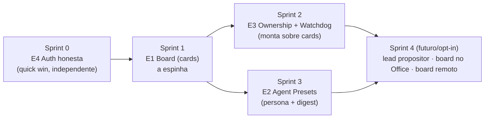

# Plano de ação — padrões do MyPeople no MyCockpit

> Backlog scrum derivado do estudo do projeto `~/projetos/mypeople` (runtime
> self-hosted que orquestra Claude/Codex/Grok como um time via board + Boss
> sempre-ligado). Data: 2026-07-22.
>
> **Premissa que guia tudo:** o MyCockpit NÃO copia o Boss autônomo sempre-ligado
> do MyPeople (fere o local-first, o app fecha e a missão morre com ele, você é o
> piloto). Portamos as peças que cabem na ideia atual (board de intenção, personas
> versionadas, ownership, watchdog in-app, auth honesta) e trocamos o despacho
> autônomo por **gesto humano + proposta gated**. Respeitar o princípio do
> `autonomy.md`: nada de over-engineering prematuro, campo reservado vale mais que
> mecanismo especulativo.

## Contexto: onde já estamos (não construir o que existe)

| Peça do MyPeople | Já temos no MyCockpit | Gap real |
|---|---|---|
| Board de prioridades | `Painel/MissionControl` (fila "PRECISAM DE VOCÊ", ENTREGAS, FROTA) | falta a **unidade durável de INTENÇÃO** (card que nasce antes do trabalho e sobrevive à conversa) |
| Ping de eventos | inbox via `interaction://request` + notificações + companion WS | nenhum, reusar |
| Roles versionados (digest) | injeção de blocos no PROMPT (`buildLearningBlocks` no send do Linear e do dock do Office) | falta a **persona nomeada e versionada** por cima do cano existente |
| Ownership + watchdog | auto-revive (`lib/autoResume.ts`), companion "gate mudo re-notifica" | falta owner de card + varredura genérica de silêncio |
| Auth honesta | a sonda REAL já existe no Rust (`detect.rs`: `claude auth status`, `codex login status`, `agy models`) + marca `limitedAgents` de rate-limit | a UI **descarta o sinal**: `availability()` colapsa deslogado/unknown, FROTA/Settings não mostram auth, Office acende mesa deslogada, rate-limit não chega ao posto |

Modelo de dados atual (referência): SQLite **v24** (máxima: `conversations_model`), hierarquia `Project → Conversation → items[]` (JSON), tabelas `projects`, `conversations` (com `agent`/`req_model`/`effort`), `fusion_runs`, `stage_runs`, `turn_costs`, `deliveries`, `lessons`, `schedules`. SDD é filesystem-first (`.claude/plans/{slug}/manifest.json`). Inbox é fila em memória (zustand) alimentada pelo MCP server (`approval.rs`).

## Épicos

- **E1 · Board de intenção** — card durável cross-conversa, ligado à conversa que o executa.
- **E2 · Personas versionadas** — Agent Preset nomeado, montado por digest, fail-closed.
- **E3 · Ownership + Watchdog** — dono vitalício de card + varredura de silêncio in-app.
- **E4 · Auth honesta** — estado da mesa/frota reflete prontidão real, não só presença.

## Sequência (dependência + valor)

Racional da ordem: **E4 primeiro** porque é barato, independente e destrava confiança no despacho (não mandar card pra mesa falso-verde). **E1 é a espinha** (E3 depende dele; E2 se beneficia dele). **E3 e E2 são paralelizáveis** depois do board. **Sprint 4** é autonomia/superfície extra, só quando o núcleo estabilizar.

---

## Sprint 0 · E4 — Auth honesta (aquecimento, ~baixo risco)

**Objetivo:** o estado "pronto/verde" de uma mesa (Office), da FROTA (Painel) e das
Settings nunca mente. Presença de binário não é prontidão.

> ⚠️ **Correções pós-leitura do código (2026-07-22):** a sonda de auth **JÁ EXISTE
> e é honesta no Rust**. `detect_agents` (`src-tauri/src/detect.rs:201`) roda probes
> em paralelo: `claude auth status` (JSON `loggedIn`), `codex login status` (decide
> por exit code) e `agy models` (proxy, agy não tem comando de auth), devolvendo
> `auth: "ok"|"missing"|"unknown"|"na"` + `detail` (email/método). O problema está
> todo no CONSUMO: (1) `availability()` (`agents.ts:255-265`) **colapsa** `missing`
> (deslogado) e `unknown` num único `installed-auth-unknown`; (2) FROTA
> (`MissionControl.tsx:945-978`) e Settings (`SettingsDialog.tsx:205-233`) mostram
> só "instalado", ignoram `probe.auth`/`probe.detail` que o Rust já coleta; (3) o
> Office (`derive.ts:240`) só apaga mesa com `missing`/`not-integrated` — CLI
> instalada e DESLOGADA acende "Disponível"; (4) rate-limit por agente JÁ existe
> (`limitedAgents` em `app.ts:43`, alimentado por `limit_reached` em `chat.ts:1131`,
> curado por `result ok`) mas só chega ao Composer e ao InboxBell, não ao
> Office/FROTA. **O sprint é de fiação de UI, não de sonda nova.** O tipo se chama
> `Availability` (não "AgentReadiness").

**Stories**
- **S0.1 — 4º estado em `availability()`** (`agents.ts:255-265`): separar
  `installed-not-authenticated` (`probe.auth === "missing"`) de
  `installed-auth-unknown` (`probe.auth === "unknown"`). Revisar os 3 consumidores:
  `derive.ts:239`, `OnboardingWizard.tsx:230`, `companion.ts:368` (`usableAgents`).
  Deslogado NÃO é usável; auth-unknown segue usável (degradação honesta).
- **S0.2 — rate-limited vira blocked no posto:** `derive.ts` e a FROTA passam a ler
  `limitedAgents` do `useApp` e renderizam o posto bloqueado com o `reset_hint`
  ("Claude em rate limit, volta ~19h"). Nada novo a persistir: a marca já é
  efêmera e curada por `result ok` (`chat.ts:1131-1138`).
- **S0.3 — render honesto:** Office: mesa de CLI deslogada ganha estado próprio
  (apagada/âmbar) com label "Instalado, sem login". FROTA e Settings mostram
  `probe.auth` + `probe.detail` (email/método de login) na linha de status/hover.
- **S0.4 — companion:** `usableAgents` exclui `installed-not-authenticated`;
  linguagem visual alinhada aos 4 estados.

**Critério de aceite:** CLI instalada e deslogada aparece apagada/âmbar com motivo,
nunca verde, no Office, na FROTA e nas Settings; agente rate-limited aparece
bloqueado no posto com hint de volta; testes (vitest, PT) de `availability()` (4
estados — hoje NÃO existe nenhum teste dela) e do mapeamento estado→mesa no derive.

**Riscos:** os probes já rodam fora do caminho crítico (boot + "Verificar agora"
das Settings) — não inventar sonda nova nem cache/TTL. Limitação aceita: agy nunca
reporta `missing` (não tem comando de auth), então "deslogado" não é prometido pra
agy — degrada pra auth-unknown.

**✅ ENTREGUE 2026-07-22** (branch `sprint/s0-auth-honesta`, aprovado pelo reviewer
com ressalvas). 843 testes verdes (19 novos). Extras: rail/DeskMenu/BossCenter do
Office mostravam "não detectado" pra QUALQUER mesa off — agora mostram o motivo
real; instrução por motivo (`offInstruction` no derive, testada). **Follow-ups do
review (fazer depois do núcleo):** (1) mesa em rate limit não tem affordance de
retry no Office (a cura só vem de `result ok` via Composer, marca não expira por
relógio); (2) despacho não consulta availability (`sendFromDesk` e
`companion send_message` mandam turno pra CLI deslogada e falham com erro cru);
(3) `availability()` sem probe degrada pra "ready" (mesa acende sem evidência se
`detect_agents` falhar no boot) e `deskBaseState` é if-chain sem check `never`.

---

## Sprint 1 · E1 — Board de intenção (a espinha)

**Objetivo:** introduzir o **card** como unidade durável de intenção, ligada à
conversa que a executa, renderizada no Painel que já existe. Sem Boss autônomo.

> ⚠️ **Correções pós-leitura do código (2026-07-22):** (1) a migração **v24 já
> existe** (`conversations_model`) — o board é **v25** se for por `lib.rs`. (2) O
> CRUD do banco vive no **FRONT (`src/lib/db.ts`)** via `@tauri-apps/plugin-sql`
> (`db.select`/`db.execute`), **NÃO em comandos Rust** — cards não precisa de
> `#[tauri::command]`. (3) Há duas convenções de schema: `lib.rs` migrations
> (tabelas núcleo) e **`ensure*Tables(db)` runtime em `db.ts`** (deliveries/lessons,
> as adições mais recentes). O board é feature que vai evoluir (comments/proofs
> depois) → seguir o padrão `ensureLearningTables` (`db.ts:581`).
>
> **Revisão 2026-07-22 (gaps novos):** (4) **custo por card NÃO "sai de graça"**:
> `loadLedger` (`db.ts:801`) nem projeta `conv_id`, e só `turn_costs` TEM `conv_id`
> (`deliveries` é por projeto, `stage_runs` por projeto+slug). (5) **não existe
> cascade nenhum no schema**: `deleteConversation` (`db.ts:352`) é DELETE puro;
> card ligado a conversa deletada vira órfão se ninguém limpar (projetos são só
> arquivados, soft delete, sem risco). (6) **SDD não é indexado por conversa**
> (entidade natural = projeto+slug): card de SDD fica fora do v1. (7)
> `newConversation` (`chat.ts:755`) cria com `agent: null` e JÁ ABRE a conversa
> (seta activeId+projectId); o agent só é carimbado no 1º turno. (8) transplant
> (`beginTransplant`, `chat.ts:1290`) MANTÉM o mesmo conversation_id — o link do
> card sobrevive a resume/transplant.

**Stories**
- **S1.1 — schema** (`src/lib/db.ts`, espelhando `ensureLearningTables` em `db.ts:581`):
  `ensureBoardTables(db)` guardada por flag `boardReady`, com
  `CREATE TABLE IF NOT EXISTS cards ( id TEXT PRIMARY KEY, project_id TEXT,
  title TEXT NOT NULL, body TEXT, state TEXT NOT NULL DEFAULT 'backlog',
  assignee_agent TEXT, conversation_id TEXT, owner TEXT, pinned INTEGER NOT NULL
  DEFAULT 0, pin_rank INTEGER, created_at INTEGER NOT NULL, updated_at INTEGER
  NOT NULL )` + `CREATE INDEX IF NOT EXISTS idx_cards_project ON
  cards(project_id, state)`. Colunas futuras via o helper `addColumn` (`db.ts:572`,
  absorve só "duplicate column"). Alternativa: migração `lib.rs` **v25** + índice
  **v26** no mesmo estilo de `stage_runs` (`lib.rs:246`).
- **S1.2 — CRUD em `db.ts`** (funções TS, padrão de `insertProject`/`listConversations`):
  `createCard(c)`, `listCards(projectId?)`, `updateCard(id, patch)`,
  `setCardState(id, state)`, `linkCardConversation(id, convId)`. Param
  posicional `$1..$n`, `db.execute`/`db.select<Row[]>`. Fechar (`done`/`cancelled`)
  NÃO é exposto como setState livre — passa por um gate humano-only (prepara o E3).
  Máquina de estados EXPLÍCITA exportada como const (`backlog → working →
  review|blocked → done|cancelled`) com transições validadas em código.
  `deleteConversation` ganha limpeza: card ligado à conversa deletada volta pra
  `backlog` com `conversation_id = NULL` (o card nunca morre junto — é a intenção
  que sobrevive à conversa, essa é a razão de ele existir).
- **S1.3 — store `src/store/cards.ts`** (zustand, espelha `fusion.ts:218`
  `create<CardsState>((set, get) => ...)`): `byProject`/`all`, `load(projectId?)`,
  `create`, `move(id, state)`, `dispatch(id)`. Nada de TanStack Query novo se o
  padrão dominante é store + load no efeito (como `MissionControl` já faz).
  **Hidratar no BOOT**, não só quando o Painel abre (precedente: side-effect
  `import "@/store/interactions"` em `App.tsx:36`, ou efeito no `App.tsx` como
  schedules em `:252`) — o vigia do Sprint 2 só enxerga store hidratado.
- **S1.4 — despacho por gesto humano:** `dispatch(cardId)` chama
  `newConversation(projectId)` (`chat.ts:755`: cria com `agent: null` e já abre a
  conversa) e chama `linkCardConversation(id, convId)`. O `assignee_agent` é
  carimbado quando o 1º turno resolve o agent, não no gesto (a conversa nasce sem
  agent). Nunca sequestra thread existente do usuário. Card vira `working`.
  Transplant não quebra o link (mesmo conversation_id).
- **S1.5 — UI no Painel** (`components/panel/MissionControl.tsx`): a render é uma
  `<ScrollArea>` a partir de `MissionControl:709`, com blocos na ordem fixa
  AÇÕES → PRECISAM DE VOCÊ (`queue` useMemo em `:593`) → ENTREGAS → FROTA. Inserir
  um `<BoardLane>` (Backlog · Em andamento · Feito) **entre AÇÕES e PRECISAM DE
  VOCÊ**, alimentado por `useCards`. Custo-por-card v1 = query direta em `turn_costs`
  por `conv_id` (nova função pequena em `db.ts`; `loadLedger` não serve, descarta
  `conv_id`). Cobre chat + Fusion; missão (`deliveries`) e SDD (`stage_runs`) não
  têm `conv_id` — o custo deles fica fora do card no v1, e a UI diz isso em vez de
  fingir total.
- **S1.6 — ping reusando o que existe:** cards em `review`/`blocked` entram na MESMA
  fila "PRECISAM DE VOCÊ" — o `queue` useMemo (`MissionControl:593`) já monta
  `Decision[]` de `scanDecisions` + disputas `deciding`; basta mapear card→`Decision`
  e concatenar. Notificação nativa/inbox ao vivo (via `interaction://request`) fica
  para quando precisar de push fora do Painel; no v1 o Painel É a superfície.

**Critério de aceite:** criar um card no backlog, iniciá-lo (nasce uma conversa
ligada, card vira `working`), ver o custo acumular no card, movê-lo pelas colunas, e
um card `review`/`blocked` aparecer na fila "PRECISAM DE VOCÊ". Testes (vitest, PT):
CRUD de `db.ts` (mock do Database), `dispatch` grava `conversation_id`, mapeamento
card→Decision, e o gate "só humano fecha".

**Riscos / não-fazer:** não portar o Boss sempre-ligado (despacho é humano);
comentários/proofs do card ficam para depois (inbox + itens da conversa cobrem o v1);
não introduzir TanStack Query só pro board se o padrão do Painel é store+efeito;
card de SDD fica FORA do v1 (a entidade dele é projeto+slug, não conversa — quando
entrar, ganha chave própria `sdd_slug`, não um `conversation_id` forçado).

**✅ ENTREGUE 2026-07-22** (branch `sprint/s1-board`, aprovado pelo reviewer com
ressalvas D1-D4, todas corrigidas antes do merge). 873 testes verdes (30 novos).
Decisões que valem registro: máquina de estados ganhou regressões honestas
(`review|blocked→working`, `working→backlog`, `cancelled` de qualquer não-terminal);
`newConversation` passou a retornar `Promise<string>` (dispatch determinístico +
guarda anti duplo-clique); assignee carimbado via hook em `start`/`beginTransplant`
(lazy mentiria: `conversations.agent` tem DEFAULT claude-code); delete preserva
cards terminais (só solta o link). **Follow-ups (nits do review):** card de projeto
arquivado continua no board mas some da fila (divergência board×fila); coluna
"Feito" corta em 8 sem indicar mais antigos; re-dispatch após falha parcial órfã a
1ª conversa (auto-cura, comentado no código).

---

## Sprint 2 · E3 — Ownership + Watchdog (sobre o board)

**Objetivo:** um card tem um dono para a vida; nada é abandonado em silêncio,
enquanto o app está aberto.

> ⚠️ **Correções pós-leitura do código (2026-07-22):** o **watchdog JÁ EXISTE** —
> `src/lib/watchdog.ts` é um vigia completo de turno mudo: subscribe coalescido
> (≥5s) + ticker de 30s (`startTurnWatchdog`, `watchdog.ts:131`), disciplina de
> **1 aviso por episódio**, knob `settings.stalledAfterMin` (default 10min, 0=off,
> `settings.ts:66,100`), notificação nativa (`notifyTurnStalled`, `notify.ts:97`) +
> toast acionável com "Ver conversa"/"Cancelar turno", flag transient `stalledSince`
> na conversa (o derive do Office e o snapshot do Companion já leem). O Sprint 2
> **estende esse arquivo**, não constrói do zero. Descartar a ideia anterior de
> "intervalo em Rust" e "backoff/jobs persistidos" — o padrão do projeto é o vigia
> in-app do `watchdog.ts` com memória em `Map` de módulo.
>
> **Revisão 2026-07-22 (gaps novos):** (1) o vigia observa SÓ o `useChat` e é
> ligado no mount do App (`App.tsx:247`); pra enxergar cards, `store/cards.ts` TEM
> que hidratar no boot (ver S1.3), senão o ticker varre store vazio. (2) semântica
> de `owner` v1: o dono É a conversa ligada (`conversation_id`, imutável, sobrevive
> a transplant); a coluna `owner` fica como campo reservado pra identidade de
> persona (Sprint 3) — não inventar identidade antes de persona existir. (3)
> **dedupe de aviso**: card `working` com conversa muda JÁ é coberto por
> `checkStalledTurns`; `checkStalledCards` cuida só de `review`/`blocked`
> (esperando humano), senão o mesmo silêncio dispara dois avisos. (4) os testes do
> vigia têm padrão pronto pra copiar (`watchdog.test.ts`): `T0` constante, `now`
> injetado, `beforeEach` com `_resetWatchdogState()` + `useChat.setState({byId:{}})`,
> mocks de `sonner`/`@/lib/notify`/`@/lib/agent`.

**Stories**
- **S2.1 — owner vitalício** (`cards` do Sprint 1 + `store/cards.ts`): o dono v1 É
  a conversa ligada (`conversation_id` fixado no `dispatch`, imutável); a coluna
  `owner` fica reservada pra persona do Sprint 3. Follow-up
  reabre a MESMA conversa: `openCardConversation(cardId)` espelhando `openStalledConv`
  (`watchdog.ts:61`: `setActiveProject` + `openProject` + `switchConversation` +
  `setViewMode("linear")`). **Fechar é humano-only:** o store `move(id, state)`
  **recusa** `done`/`cancelled` (lança); só um `closeCard(id)` explícito, chamado por
  gesto de UI, fecha. Nunca troca de owner por follow-up.
- **S2.2 — generalizar o vigia** (`src/lib/watchdog.ts`): adicionar
  `checkStalledCards(now)` ao lado de `checkStalledTurns` (`watchdog.ts:92`), dirigido
  pelo MESMO ticker + subscribe. Varre cards `blocked`/`review` (esperando HUMANO)
  parados além do limiar (sinal = `updated_at` do card); cards `working` com
  conversa muda JÁ são cobertos por `checkStalledTurns`, não duplicar o aviso;
  **1 aviso por episódio**
  (segundo `Map` de marcas keyed por cardId, mesmo padrão do `marks`), disparando
  `nativeNotify` + toast acionável ("Abrir card"/"Concluir") + um sinal transient no
  card (espelhando `stalledSince`). Reusa `settings.stalledAfterMin`.
- **S2.3 — surfacing** (`src/lib/inbox.ts`): a união `Decision` (`inbox.ts:9`) ganha
  `{ kind: "card"; cardId; projectId; projectName; title; state }`; `scanDecisions`
  (ou o próprio vigia) inclui cards `blocked`/`review`/mudos. A fila "PRECISAM DE VOCÊ"
  (`MissionControl:593`, já `Decision[]`) renderiza sem código novo de layout. Sinal de
  "silêncio" do card = `updated_at` (ou última atividade da conversa ligada).
- **S2.4 — caveat honesto na UI:** o vigia roda **com o app aberto** (`startTurnWatchdog`
  é ligado no mount, subscribe + interval). Não cutuca app fechado. Remoto = companion
  + Tailscale, já desenhado; o snapshot do Companion já lê `stalledSince`, então o
  stall de card flui pro celular pelo mesmo caminho.

**Critério de aceite:** um card em `blocked`/`review` parado além de `stalledAfterMin`
dispara UM aviso (nativa + toast + entra em "PRECISAM DE VOCÊ") e não repete no mesmo
episódio; `move` para `done`/`cancelled` lança e só `closeCard` fecha; follow-up reabre
a mesma conversa e não troca o owner. Testes (vitest, PT, com `now` injetável e
`_resetWatchdogState`, exatamente como os testes atuais do vigia): 1-por-episódio de
card, owner imutável, gate humano-only, mapeamento card→Decision.

**Riscos:** não transformar o vigia em daemon (ele é in-app por design); não prometer
nudge com app fechado; não duplicar o ticker (um só, checando turnos E cards).

**✅ ENTREGUE 2026-07-22** (branch `sprint/s2-ownership-watchdog`, aprovado pelo
reviewer com ressalvas, todas corrigidas antes do merge). 886 testes verdes (13
novos). Correções que valem registro: relógio ÚNICO por mutação de card (o store
passa `now` pro banco — o drift store×banco duplicava aviso pós-reload); conversa
ligada `running` segura o vigia e re-ancora o episódio (sem falso "esperando você"
com agent trabalhando); toast sem "Concluir" às cegas (gate humano do board).
**Follow-ups (nits aceitos):** aviso duplo legítimo card `review` + turno MUDO da
mesma conversa (semanticamente distintos, barulhento); nativas antigas do vigia de
turno ainda usam travessão (alinhar copy noutro diff); título de card longo sem
truncamento defensivo na nativa.

---

## Sprint 3 · E2 — Agent Presets (personas versionadas)

**Objetivo:** elevar a identidade de `(CLI, model, effort)` para uma **persona
nomeada e reusável**, montada por digest, fail-closed. Reusa o cano de injeção que
já existe.

> ⚠️ **Correções pós-leitura do código (2026-07-22):** (1) o `--append-system-prompt`
> do Claude JÁ é usado, mas **hardcoded** só pro nudge da `ask_user` (`adapters.rs:278`),
> e a struct `RunRequest` (`adapters.rs:12`) **não tem campo de system próprio**. (2)
> As lições NÃO vão no system: `buildLearningBlocks` (`learning.ts:41`) é **prependido
> ao `prompt`** no front. (3) Logo a persona v1 é injetada como as lições (bloco no
> prompt), no PRIMEIRO turno da conversa — o `--resume` do CLI carrega o system daí
> pra frente (mesmo racional do onboarding do Boss no MyPeople: injeta a doutrina 1×).
> Um campo `append_system` dedicado no `RunRequest` é a maturação, não o v1.
>
> **Revisão 2026-07-22 (gaps novos):** (4) o sinal de 1º turno JÁ existe nos pontos
> de send: `locked = conv.items.length > 0` (`send.ts:182`, `ChatPanel.tsx:276`) —
> persona entra quando `!locked`. (5) são TRÊS caminhos de montagem de prompt:
> `ChatPanel.tsx:296` (Linear), `office/bridge/send.ts:205` (dock, cópia declarada
> do padrão) e `mission.ts:490` (estruturado via `phasePrompt`). **O preset v1
> cobre Linear + dock**; Mission já tem personas de fase próprias e Fusion não
> injeta blocos — ficam fora. (6) **v25/v26 do `lib.rs` ficam RESERVADAS pros
> presets** (o board vai por `ensure*` no `db.ts`, sem número); versão de migração
> é ponto de serialização entre sprints — quem criar migração registra o número
> aqui antes. (7) editar preset = mutar a linha + `version+1` + digest novo;
> conversas antigas guardam o digest velho e o drift do S3.4 é exatamente o aviso
> desejado, não um bug. Limitação aceita no v1: o digest cobre NOMES de skills, não
> o conteúdo dos arquivos (drift de conteúdo de skill não é detectado).

**Stories**
- **S3.1 — schema do preset** (`src/lib/db.ts`, padrão `ensureLearningTables`/`ensureBoardTables`):
  `ensureAgentPresetTables(db)` com `CREATE TABLE IF NOT EXISTS agent_presets (
  id TEXT PRIMARY KEY, name TEXT NOT NULL, personality_md TEXT, skills_json TEXT,
  policy TEXT, backend TEXT NOT NULL, model TEXT, effort TEXT, digest TEXT NOT NULL,
  version INTEGER NOT NULL DEFAULT 1, created_at INTEGER NOT NULL, updated_at INTEGER
  NOT NULL )`.
- **S3.2 — carimbo na conversa** (`lib.rs` migrations, padrão dos ALTER de
  `conversations` v9-v24): **v25** `ALTER TABLE conversations ADD COLUMN preset_id
  TEXT;` + **v26** `ALTER TABLE conversations ADD COLUMN preset_digest TEXT;` (como o
  MyPeople grava `role_ref`+`role_digest` no roster). `db.ts` passa a ler/gravar essas
  colunas em `loadConversation`/`createConversation`.
- **S3.3 — digest + montagem** (`src/lib/presets.ts` novo): `presetDigest(p)` =
  `sha256` (`crypto.subtle.digest`) sobre a serialização canônica estável de
  `{personality_md, skills(sorted), policy, backend, model, effort}`. Montar =
  `buildPersonaBlock(preset)` prependido ao prompt no PRIMEIRO turno (mesmo ponto onde
  `buildLearningBlocks` entra no `handleSend`/`send.ts`). **Fail-closed preflight:**
  antes do 1º run, resolver o preset — personality presente e cada skill referenciada
  existe em `.claude/commands/` (o `read_project_commands`/`context.ts` já inventaria);
  skill faltando **aborta o run** (não injeta persona meia-boca).
- **S3.4 — verificação de drift no resume/transplant** (`store/chat.ts`, no
  `beginTransplant` e no caminho de resume): recomputar `presetDigest` do preset atual
  e comparar com `conversations.preset_digest` carimbado. Diferente ⇒ recusa ou avisa
  (o `expected_role_digest` do MyPeople). Um agente revivido não volta sob outra
  doutrina em silêncio.
- **S3.5 — Office** (`office/bridge/derive.ts`): a mesa exibe "claude-code COMO UI
  Engineer" (generalizar o "persona na label" que as fases de missão já usam,
  `agent-office.md` §4).
- **S3.6 — seleção + CRUD** (composer `AgentSelect` + `components/settings/`): iniciar
  conversa "como" preset (um nível acima do seletor agent/model/effort atual, que fica
  como a camada crua). Gerenciar presets nas Settings (nome + personality + skills +
  policy + backend/model/effort) com preview do digest.

**Critério de aceite:** criar um preset, iniciar uma conversa com ele (bloco de persona
injetado no 1º turno, `preset_id`/`preset_digest` carimbados), reviver e ter o digest
verificado, editar o preset e ver o drift barrado numa conversa antiga, e uma skill
inexistente abortar o run antes de gastar turno. Testes (vitest, PT): digest estável e
determinístico, fail-closed de skill faltante, verificação de drift no transplant.

**Nota:** este é o item "Roles com DIGEST (padrão MyPeople)" já listado no backlog do
`agent-office.md`; aqui ele ganha esqueleto de tabela, cano de injeção real e pontos de
integração.

**✅ ENTREGUE 2026-07-22** (branch `sprint/s3-presets`, aprovado pelo reviewer com
ressalvas D1-D4, todas corrigidas antes do merge). 935 testes verdes na main
combinada (49 novos do sprint). Robustez adicionada pós-review: re-injeção quando a
conversa nunca teve resposta (spawn morto não tranca a doutrina), transplant leva a
doutrina no preâmbulo de handoff, carimbo com await, re-check de running pós-await
nos sends E transplants. **Follow-ups (nits aceitos do review):** copy do preflight
diz "skill não existe" quando a causa real pode ser FS ilegível (o inventário Rust
degrada pra lista vazia); `presetName` da mesa resolve 1x no load (renomear preset
não atualiza a label até recarregar); `driftWarned` Map não é limpo em delete de
conversa (crescimento irrisório); dock do Office segue camada crua (preset só via
composer principal); automações agendadas sem preset no v1.

---

## Sprint 4 · Futuro / opt-in (só depois do núcleo estável)

- **Lead propositor (autonomia gated):** um agente opt-in lê cards abertos e
  **propõe** um plano no inbox (reusa o helper Haiku). Nunca despacha sozinho; você
  aprova. Casa com o M3/M4 do `autonomy.md`.
- **Board no Office:** a "Central do Boss" elevada de per-conversa para cross-projeto,
  derivando o `OfficeSnapshot` de `cards` (whiteboard do portfólio).
- **Board remoto:** cards + owner + watchdog no companion (triagem e despacho pelo
  celular via `sendFromDesk`, guardas intactas), sobre Tailscale.
- **Sinergia com aprendizado:** card entregue com `ok=true` alimenta o delivery
  recall (M1) e o auto-tuning de time por custo (M3) que já estão no `autonomy.md`.

---

## Definition of Done (transversal)

- Migração idempotente + testada; nada apaga dado de usuário (padrão das v1-v24).
- Comando Tauri com enum de permissão exaustivo onde toca ação (`adapters.rs`).
- Fail-closed onde há montagem/estado (preset, card terminal, auth).
- Teste vitest em PT cobrindo o caminho feliz + a guarda principal.
- Custo/estado deriva de fonte única (sem segunda fila, sem atividade inventada —
  a regra dura do Office "estado real, nunca teatro").
- Sem travessão em copy de UI (padrão do projeto).

## O que deliberadamente NÃO fazemos

- Boss autônomo sempre-ligado (fere local-first; despacho é humano).
- Daemon fora do app / nudge com app fechado (isso é papel do companion + Tailscale).
- Comments/proofs ricos no card v1, roles-store em disco versionado, ou lead
  autônomo sem gate — tudo reservado, implementado com volume/necessidade real.

---

## Execução com time de agents (preparado 2026-07-22)

Time definido em `.claude/agents/` na raiz do repo (o repo git é a RAIZ
`~/projetos/mycockpit`; `app/` não é repo próprio — worktrees e branches nascem da
raiz):

| Agent | Papel | Quando usar |
|---|---|---|
| `mycockpit-dev` | implementa stories | 1 story (ou 1 sprint pequeno) por vez |
| `mycockpit-tester` | escreve/roda os testes de aceite | depois do dev, antes do review |
| `mycockpit-reviewer` | bate a Definition of Done + guardas | último gate antes do merge |

**Ordem de despacho** (1 branch por sprint, review entre elas):

1. **Sprint 0** primeiro: pequeno, independente, e serve de shakedown do fluxo do
   time (dev → tester → reviewer) num diff barato.
2. **Sprint 1** sozinho: é a espinha; nada de S2/S3 antes do merge dele.
3. **Sprints 2 e 3 em paralelo** (worktrees separadas). Pontos de serialização:
   - migrações `lib.rs`: v25/v26 são do Sprint 3; o board não usa número;
   - arquivos quentes: S2 mexe em `watchdog.ts`/`inbox.ts`/`cards.ts`; S3 mexe em
     `send.ts`/`ChatPanel.tsx`/`chat.ts`/`lib.rs`. Overlap real: só `db.ts` (cada
     um adiciona sua função `ensure*`, merge trivial). Mergear S2 primeiro (menor).
4. Cada story: dev implementa → tester cobre o critério de aceite → reviewer bate o
   checklist. Reviewer reprova = volta pro dev com findings, não corrige por cima.

**Prompt de despacho padrão:** "Implemente a story SX.Y de
`docs/mypeople-patterns-plan.md`. Leia a sprint INTEIRA antes, incluindo os blocos
⚠️ de correção (eles mandam sobre o texto original)."
